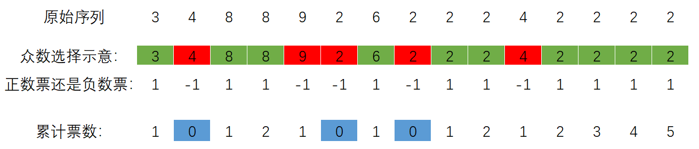

# 【Leetcode面试经典150题】169. 多数元素-Java-摩尔投票

代码小白，技术薄弱，欢迎大佬指点！

最开始直接想法是HashMap进行统计，通过但是慢。

## 题目：


## 分析：

题目中说到，出现次数**大于 ⌊ n/2 ⌋** 的元素。如果n为奇数，比如7，应该出现大于3次，也就是4次或者更多；如果是偶数，比如10，应该出现大于5次，也就是6次或更多。

所以可以确定，我们要寻找的多数元素的数量是大于其他所有元素之和。

假设众数记为+1票，其他数记为-1票，那么最终的投票结果依旧是正数。

那么问题是如何知道哪个数是众数呢？

不妨假设，在累积票为0的时候，第一个遇到的就是众数，如图所示。

绿色表示当前数字被选择作为众数，红色数字表示与当前众数不同，被视为非众数。这部分操作并不考虑到全局，只进行考虑局部，因此在众数选择示意中存在“2”被标注为红色。

从左向右累积计票，当累积票数归零时（蓝色方块），选择下一个数字作为众数（绿色方块）。



从左向右遍历，最终的众数即为该序列的众数。

以此例，另一种理解方法是：

如果“2”被选作众数，那么不同的是非众数，抵消它，浪费1票；

如果其他数字选作众数，那么“2”被视为非众数，抵消其他数字，浪费1票；

如果其他数字被选作众数，遇到不同的其他数字，如8与9，内部消耗，没有浪费数字“2”的票；

最终，无论如何，都是众数持有最后的票。

## 实现：

使用两个临时变量，vote用于统计当前累积票数；x用于记录当前众数。遍历数组，不断更新累积票数和当前众数。最后返回x即可。

## 代码：

```java
import java.util.HashMap;

public class N169_MostElements {
    public static void main(String[] args) {
        int[] nums1 = new int[]{2,2,1,1,1,2,2};
        int[] nums2 = new int[]{3,2,3};
        int[] nums3 = new int[]{2};
        System.out.println(majorityElementMooreVotes(nums1));
        System.out.println(majorityElementMooreVotes(nums2));
        System.out.println(majorityElementMooreVotes(nums3));
    }

    public static int majorityElementMooreVotes(int[] nums) {
        int vote = 1;
        int x = nums[0];
        for (int i = 1; i < nums.length; i++) {
            if (vote == 0){
                x = nums[i];
                vote++;
            }else {
                if (nums[i]!= x){
                    vote--;
                }else {
                    vote++;
                }
            }
        }
        return x;
    }
}

```

